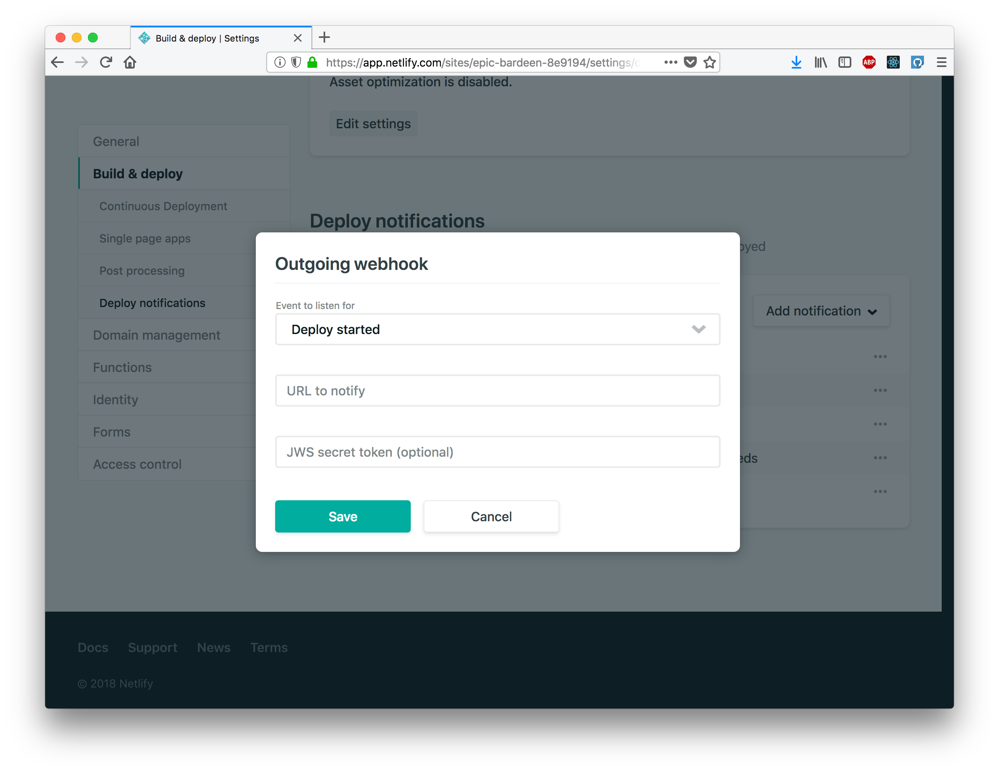

# NOTICE: This package has been deprecated and replaced with https://github.com/lannonbr/netlify-bulb

# Netlify-Deploy-Bulb

I've made a project using the LIFX bulbs to make a setup so when a deploy on Netlify runs, it will respond to a webhook and change the lights to show if a build was successful or not.

# Setup

The code is an AWS Lambda function that responds from an AWS API Gateway http trigger. I have set it up so if it hits the endpoint with a state query of either success or fail, it will notify the lights to go either red or green.

The code is currently configured to work with AWS, but it likely isn't too difficult to modify it to another cloud platform or running on some server.

Then, I set up on whatever site I want to use with this, I head to netlify's deploy settings for the site, go to "Deploy Notifcations", and add a new outgoing webhook for various states and hit the specific endpoint I have on AWS.

For example, I set up a webhook for "Deploy Suceeded" to hit
`https://<endpoint_url>/NetlifyDeployBulb?state=success`.

If you would like to learn more about Netlify's deploy webhooks, view their [Docs](https://www.netlify.com/docs/webhooks/)

# License

The project is licensed with the MIT License
